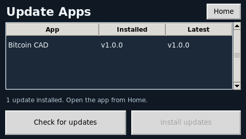

# Update Apps for PocketCHIP

Install and update your PocketCHIP apps from a 480 × 272 touchscreen interface.
The catalog includes **Bitcoin CAD** and **App Updater (self)**.

Starting with **1.6.0**, Bitcoin versions and source downloads come from the
[Vitrallis Apps catalog](https://raw.githubusercontent.com/csd113/Vitrallis-Apps/main/apps.json).
The updater continues to update itself from this repository.

[Latest release](https://github.com/csd113/Pocketchip-update-apps/releases/latest)
· [Changelog](CHANGELOG.md)
· [Bitcoin CAD](https://github.com/csd113/Vitrallis-Apps/tree/main/Apps/Bitcoin-Dashboard)



## Install or upgrade

Paste this single command into the PocketCHIP terminal as your normal user
(usually `chip`), without `sudo`:

```sh
sh -c 'set -e; f=$(mktemp); trap '\''rm -f "$f"'\'' EXIT; curl -fsSL https://raw.githubusercontent.com/csd113/Pocketchip-update-apps/main/install.sh -o "$f"; sh "$f"'
```

The command installs the latest version from `main`. Running it again upgrades
or reinstalls the updater without duplicating its Home-menu entry.

**Requirements:** internet, `curl`, Python 3.7+, and PocketHome with an Apps page.
The installer reuses an existing app-local Python/Tk runtime, keeping a separate
copy for the updater, or installs `python3-tk` through apt. The apt fallback
requires working repositories and may ask for your sudo password.

After a first install, restart PocketHome or reboot to display the new icon.
The installer also adds desktop and application-menu shortcuts.
[GitHub Releases](https://github.com/csd113/Pocketchip-update-apps/releases)
provide versioned source archives; runtime binaries are not included.

## Use

1. Open **Update Apps** from Home.
2. Tap **Check for updates** to compare installed and latest versions.
3. Tick the checkbox beside the app you want to install or update.
4. Tap **Install selected**. Only checked apps with available changes are installed.

Nothing is checked automatically. Tick just one app to update it on its own,
or tick several to install them in sequence. Tap anywhere on a row to toggle its
checkbox. The keypad also works throughout the interface: Up/Down move through
app rows and continue to the buttons; Left/Right or Tab move between controls.
Enter or Space toggles the focused row or presses the focused button. The
highlighted row is the keyboard focus; only checked apps are installed.

If an app is running, choose **Close and update** or **Cancel**. Confirming may
lose unsaved work. Installation waits for the app to stop and skips it if it
does not close within eight seconds. Updated apps stay closed.
The prompt starts on **Cancel**. Use arrows or Tab to choose, then Enter or
Space to activate; Escape or Home cancels.

**App Updater (self)** is this updater. It replaces its files using code already
loaded in memory. After success, tap **Home**; the next manual launch loads the
new version. Further checks and installs are disabled until then.

New Bitcoin installations include a launcher, icon, and Home/desktop shortcuts.
Restart PocketHome to see new Home icons.

If Bitcoin CAD shows **incomplete / repair**, check for updates, select it, and
choose **Install selected**. The updater repairs interrupted installations and
missing launcher/icon files even when the source version is already current.
Working custom launchers and icons are retained during repair.

If the catalog disables an app, its latest version is still shown but installation
and repair are unavailable. A newer installed version is kept; a same-version
local edit or unknown local version is also kept rather than overwritten.
Checks report these conditions instead of claiming the app is up to date.

| Control | Action |
| --- | --- |
| Up / Down | Move through app rows and buttons |
| Left / Right, Tab / Shift+Tab | Move between controls, skipping disabled buttons |
| Enter / keypad Enter / Space | Toggle the focused checkbox or press the focused button |
| Check for updates / C | Check GitHub |
| Install selected / I | Install checked apps with available changes |
| Home / Escape | Close the updater when idle |

Numeric keypad arrow keys are supported with Num Lock off. Navigation wraps
between controls. After a self-update, focus moves to **Home** so Enter closes
the updater and the next launch loads the new version.

## Help and development

- Missing Tkinter: rerun the installer with internet access and working apt repositories.
- Missing Home icon after installation: restart PocketHome.
- An app does not close: its update is skipped; close it and retry.
- Updater needs repair: rerun the installation command above.

Downloads are pinned to a GitHub commit and checked before installation.
Previous sources and self-update files are backed up. Keep the device powered
during installation. Each application still needs a reviewed local installation
adapter; a new remote catalog entry alone cannot install arbitrary applications.
Bitcoin retains its existing installation directory, launcher, icon, and Home entry.

See [update behavior, backup locations, and validation commands](docs/updates.md)
for technical details. Report problems in
[GitHub Issues](https://github.com/csd113/Pocketchip-update-apps/issues), including
the installed version and any error message.
